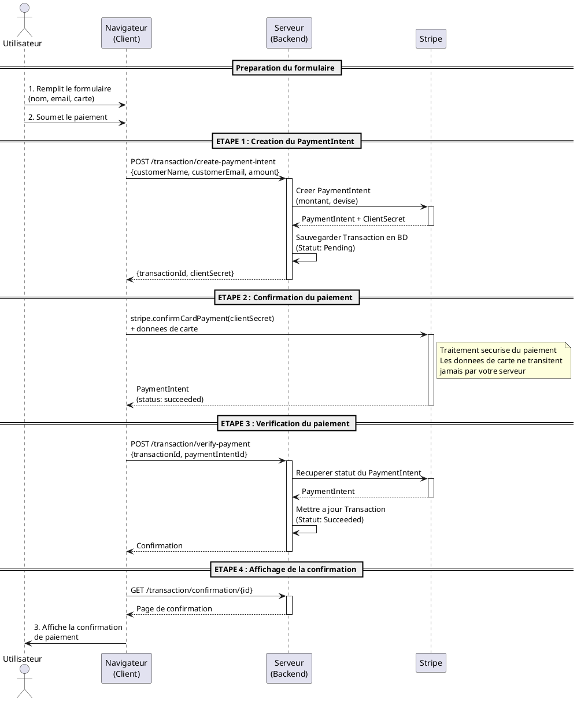

# StripeDemo - Integration Simple de Stripe avec ASP.NET Core

## A propos du projet

Ce projet est une **demonstration pedagogique** d'une integration basique de Stripe dans une application ASP.NET Core MVC utilisant .NET 8. Il illustre les concepts fondamentaux du traitement de paiements en ligne de maniere simplifiee et synchrone.

**Objectif pedagogique** : Comprendre le flux de communication entre le client, le serveur et Stripe lors d'un paiement par carte de credit.

---

## Simplifications pedagogiques

Pour se concentrer sur l'integration de Stripe, plusieurs simplifications ont ete apportees :

### Architecture simplifiee
- **Un seul produit** : Pas de catalogue ni de panier d'achat
- **Transaction basique** : Contient uniquement un montant global (pas de lignes de commande detaillees)
- **Traitement synchrone** : Pas d'utilisation de webhooks (voir section "Ameliorations possibles")
- **Base de donnees In-Memory** : Les donnees ne sont pas persistees entre les redemarrages
- **Pas d'authentification** : Aucune gestion d'utilisateurs ou de sessions
- **Pas de gestion des remboursements** : Implementation minimale du cycle de vie des transactions

### Modele de donnees simplifie
```
Product
??? Id
??? Name
??? Description
??? Price (montant fixe)

Transaction
??? Id
??? Amount (montant total)
??? Status (Pending, Succeeded, Failed, Canceled)
??? CustomerName
??? CustomerEmail
??? PaymentIntentId (reference Stripe)
??? DateCreated
```

---

## Architecture et patterns utilises

### Patterns implementes

#### 1. **Dependency Injection**
Injection de dependances native d'ASP.NET Core pour une architecture decouplee et testable.

```csharp
builder.Services.AddScoped<IStripeService, StripeService>();
```

#### 2. **Options Pattern**
Configuration de Stripe via `appsettings.json` avec le pattern Options.

```csharp
builder.Services.Configure<StripeOptions>(
    builder.Configuration.GetSection("StripeOptions"));
```

#### 3. **Service Layer Pattern**
Separation de la logique metier dans une couche de services (`IStripeService`, `StripeService`).

#### 4. **Repository Pattern (implicite)**
Utilisation d'Entity Framework Core `DbContext` comme abstraction d'acces aux donnees.

#### 5. **DTO/ViewModel Pattern**
Separation entre les modeles de domaine, les requetes API et les vues :
- **Requests** : `PaymentIntentRequest`, `VerifyPaymentRequest`
- **ViewModels** : `ProductDetails`, `ConfirmationDetails`

### Bonnes pratiques C# modernes

- **Primary Constructors** (C# 12) : Syntaxe concise pour l'injection de dependances
- **Nullable Reference Types** : Prevention des erreurs `NullReferenceException`
- **Record Types** : Pour les DTOs et ViewModels immuables
- **Async/Await** : Toutes les operations I/O sont asynchrones
- **Pattern Matching** : Utilisation de `switch expressions` pour mapper les statuts Stripe

---

## Flux de paiement avec Stripe

### Diagramme de sequence



**Note**: Pour visualiser ce diagramme, vous pouvez utiliser :
- L'extension PlantUML pour Visual Studio Code
- Le site web [PlantUML Online](http://www.plantuml.com/plantuml/uml/)
- L'extension Markdown Preview Enhanced

### Explication des etapes

#### **ETAPE 0 : Initialisation (Cote client)**
Le navigateur charge `Stripe.js` et initialise les elements de formulaire securises fournis par Stripe.

```javascript
const stripe = Stripe(publicKey);
const elements = stripe.elements();
const card = elements.create("card");
card.mount("#credit-card");
```

#### **ETAPE 1 : Creer un PaymentIntent (Serveur ? Stripe)**
Le serveur cree un `PaymentIntent` aupres de Stripe avec le montant de la transaction. Stripe retourne un `ClientSecret` qui sera utilise cote client.

```csharp
var paymentIntent = await stripeService.CreatePaymentIntentAsync(
  request.Amount,
    "cad"
);
```

**Pourquoi cote serveur ?** La creation du `PaymentIntent` necessite votre cle secrete Stripe, qui ne doit **jamais** etre exposee cote client.

#### **ETAPE 2 : Confirmer le paiement (Client ? Stripe)**
Le navigateur utilise `Stripe.js` pour confirmer le paiement de maniere securisee. Les informations de carte ne transitent **jamais** par votre serveur.

```javascript
const result = await stripe.confirmCardPayment(clientSecret, {
    payment_method: { card: card }
});
```

**Securite PCI-DSS** : Stripe gere entierement la collecte et le traitement des donnees de carte.

#### **ETAPE 3 : Verifier le paiement (Serveur ? Stripe)**
Le serveur interroge Stripe pour obtenir le statut final du `PaymentIntent` et met a jour la transaction en base de donnees.

```csharp
var paymentIntent = await stripeService.GetPaymentIntentAsync(
    request.PaymentIntentId
);
transaction.Update(paymentIntent.Status);
```

**Pourquoi verifier ?** Meme si le client indique un succes, il faut toujours valider cote serveur pour eviter les manipulations.

#### **ETAPE 4 : Confirmation**
L'utilisateur est redirige vers une page de confirmation affichant les details de sa transaction.

---

## Installation et configuration

### Prerequis

- .NET 8 SDK
- Un compte Stripe (mode test) : [https://dashboard.stripe.com/register](https://dashboard.stripe.com/register)

### Etapes d'installation

1. **Cloner le projet**
```bash
git clone https://github.com/hugolapointe/StripeDemo.git
cd StripeDemo
```

2. **Recuperer vos cles API Stripe**
   - Connectez-vous a votre [Dashboard Stripe](https://dashboard.stripe.com/)
   - Allez dans **Developpeurs ? Cles API**
   - Copiez votre **Cle publiable** (pk_test_...) et votre **Cle secrete** (sk_test_...)

3. **Configurer les cles dans `appsettings.json`**
```json
{
  "StripeOptions": {
    "PublicKey": "pk_test_VOTRE_CLE_PUBLIQUE",
    "SecretKey": "sk_test_VOTRE_CLE_SECRETE",
    "CurrencyCode": "cad"
  }
}
```

**Important** : Ne commitez **jamais** vos cles secretes dans Git. Utilisez `appsettings.Development.json` (deja dans `.gitignore`).

4. **Restaurer les dependances et lancer**
```bash
dotnet restore
dotnet run --project StripeDemo
```

5. **Acceder a l'application**
Ouvrez votre navigateur a `https://localhost:5001`

### Tester avec des cartes de test Stripe

Stripe fournit des numeros de carte pour tester differents scenarios :

| Scenario | Numero de carte | CVV | Date d'expiration |
|----------|----------------|-----|-------------------|
| Paiement reussi | `4242 4242 4242 4242` | N'importe quel | Dans le futur |
| Paiement refuse | `4000 0000 0000 0002` | N'importe quel | Dans le futur |
| Authentification 3D Secure | `4000 0027 6000 3184` | N'importe quel | Dans le futur |

Documentation complete : [Cartes de test Stripe](https://stripe.com/docs/testing)

---

## Technologies utilisees

- **ASP.NET Core 8** : Framework web moderne et performant
- **Entity Framework Core 8** : ORM pour l'acces aux donnees
- **Stripe.NET (v45.19.0)** : SDK officiel de Stripe pour .NET
- **Stripe.js** : Bibliotheque JavaScript pour l'integration cote client
- **Axios** : Client HTTP pour les requetes AJAX
- **Bootstrap 5** : Framework CSS pour l'interface utilisateur

---

## Ameliorations possibles et fonctionnalites Stripe avancees

### 1. **Webhooks Stripe** (Recommande)
**Probleme actuel** : Le flux de paiement est synchrone. Si l'utilisateur ferme son navigateur apres le paiement, la verification cote serveur ne se fait pas.

**Solution avec webhooks** :
- Stripe envoie automatiquement des notifications HTTP a votre serveur lors d'evenements (`payment_intent.succeeded`, `payment_intent.failed`, etc.)
- Permet de gerer les paiements asynchrones, les paiements differes, et les changements de statut
- Garantit la synchronisation entre Stripe et votre base de donnees

**Avantages** :
- Fiabilite : Votre serveur est notifie meme si le client se deconnecte
- Automatisation : Gestion automatique des evenements (remboursements, litiges, etc.)
- Audit : Historique complet de tous les evenements Stripe

**Implementation** :
```csharp
[HttpPost("webhook")]
public async Task<IActionResult> HandleStripeWebhook()
{
    var json = await new StreamReader(HttpContext.Request.Body).ReadToEndAsync();
    var stripeEvent = EventUtility.ConstructEvent(json, 
        Request.Headers["Stripe-Signature"], 
        webhookSecret);

    if (stripeEvent.Type == Events.PaymentIntentSucceeded)
    {
   var paymentIntent = stripeEvent.Data.Object as PaymentIntent;
        // Mettre a jour la transaction
  }
    
    return Ok();
}
```

### 2. **Stripe Checkout**
Page de paiement hebergee par Stripe, cle en main.

**Avantages** :
- Interface de paiement optimisee et responsive
- Gestion automatique des methodes de paiement (cartes, Apple Pay, Google Pay, etc.)
- Moins de code a maintenir

**Cas d'usage** : E-commerce simple sans personnalisation avancee du formulaire.

### 3. **Abonnements (Subscriptions)**
Gestion des paiements recurrents (mensuel, annuel, etc.).

**Fonctionnalites** :
- Facturation automatique
- Gestion des periodes d'essai
- Proratisation lors des changements de plan
- Gestion des echecs de paiement

**Cas d'usage** : SaaS, services en ligne, applications de contenu premium.

### 4. **Gestion des remboursements**
Permet d'emettre des remboursements partiels ou complets.

```csharp
var refundService = new RefundService();
var refund = await refundService.CreateAsync(new RefundCreateOptions
{
    PaymentIntent = paymentIntentId,
    Amount = 1000, // En centimes
});
```

### 5. **Payment Links**
Liens de paiement sans code, partageables par email ou SMS.

**Avantages** :
- Aucune integration technique requise
- Ideal pour des paiements ponctuels

### 6. **Multi-devises**
Accepter des paiements dans plusieurs devises.

**Considerations** :
- Conversion de devises automatique
- Affichage des prix localises

### 7. **3D Secure (SCA - Strong Customer Authentication)**
Authentification renforcee obligatoire en Europe (DSP2).

**Stripe gere automatiquement** :
- Detection des paiements necessitant SCA
- Declenchement du flow d'authentification
- Fallback si l'authentification echoue

### 8. **Stripe Connect**
Plateforme de paiement multi-vendeurs (marketplace).

**Fonctionnalites** :
- Comptes connectes pour les vendeurs
- Repartition des paiements
- Gestion des commissions

**Cas d'usage** : Marketplaces, plateformes de services a la demande.

### 9. **Gestion des litiges (Disputes)**
Automatisation de la reponse aux contestations de paiement.

**Fonctionnalites** :
- Notifications automatiques
- Soumission de preuves
- Gestion des chargebacks

### 10. **Analytics et rapports**
Tableaux de bord Stripe avec metriques detaillees.

**Metriques disponibles** :
- Volume de transactions
- Taux de reussite/echec
- Revenus recurrents (MRR, ARR)
- Analyse des abandons de panier

---

## Ressources pour aller plus loin

### Documentation officielle
- [Documentation Stripe](https://stripe.com/docs)
- [Stripe.NET SDK](https://github.com/stripe/stripe-dotnet)
- [Stripe Testing](https://stripe.com/docs/testing)

### Guides recommandes
- [Payment Intents API Guide](https://stripe.com/docs/payments/payment-intents)
- [Webhooks Guide](https://stripe.com/docs/webhooks)
- [Best Practices](https://stripe.com/docs/payments/payment-intents/best-practices)

### Securite
- [PCI Compliance](https://stripe.com/docs/security/guide)
- [Strong Customer Authentication (SCA)](https://stripe.com/docs/strong-customer-authentication)

---

## Licence

Ce projet est a des fins pedagogiques uniquement.

---

## Auteur

Projet developpe pour l'enseignement du commerce electronique et de l'integration de passerelles de paiement.
